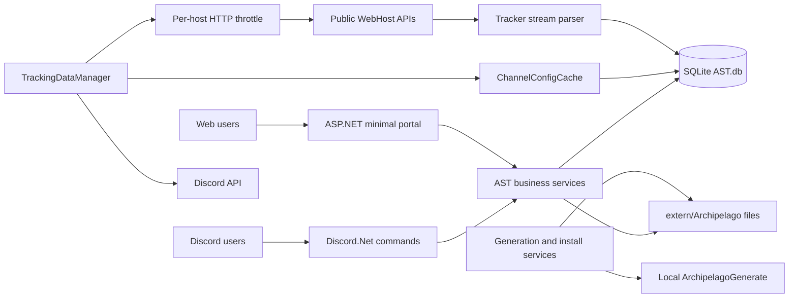

# Phase 0 audit — executive summary

Audit date: August 29, 2026  
Inspected revision: `e88a224` (`codex/evolution`)  
Full report: [French Phase 0 audit](phase-0-audit.fr.md)

## Outcome

ArchipelagoSphereTracker is an established .NET 8 application with distinct Discord, WebHost,
SQLite, web portal, generation, installation, localization, metrics, and desktop GUI areas.
The requested Normal and Archipelago modes already exist and should be evolved rather than
rewritten.

No direct Archipelago protocol client was found. Game data is fetched from public WebHost HTTP
endpoints, while the local Archipelago installation is used only for generation and APWorld tools.

The application already provides useful foundations:

- multi-guild and multi-room tracking;
- a shared tracking loop and per-host HTTP throttling;
- partial retry handling for HTTP 429 and 5xx responses;
- streaming parsing with fallbacks for missing aliases and unknown fields;
- partial item and hint deduplication in SQLite;
- Discord aliases, filters, recaps, hints, and goal notifications;
- user and room web portal pages;
- YAML/APWorld management, generation, backup, and restore;
- Prometheus metrics and Windows/Linux self-contained releases.

## Current architecture

Consumed WebHost endpoints:

- `GET /api/room_status/{room}`;
- `GET /api/tracker/{tracker}`;
- `GET /api/static_tracker/{tracker}`;
- `GET /api/datapackage/{checksum}`.

## Release-blocking findings

1. **Unauthenticated web mutations.** Existing command endpoints can add or delete rooms,
   change tracking settings, upload YAML/APWorld files, and start generation without a shared
   server-side authorization policy.
2. **Unsafe APWorld trust boundary.** APWorld content is loaded by the local Archipelago tooling.
   Upload must be restricted, validated, quarantined, and audited.
3. **Private file exposure.** YAML listings/downloads, patch links, and generated archives are not
   consistently scoped to an authenticated player.
4. **SSRF exposure.** A user controls the WebHost origin and can make AST request unapproved or
   internal hosts.

## High reliability risks

- State is committed before Discord delivery. A crash between those operations permanently loses
  the notification because there is no event ledger or outbox.
- `ChannelsAndUrlsTable` has no unique `(GuildId, ChannelId)` constraint even though writes use
  `INSERT OR REPLACE`, allowing duplicate room rows.
- Hint upserts also lack the matching unique constraint, and entrance changes can remain stale.
- Alias deletion can remove every owner of a receiver instead of only the requesting user.
- A completed room is deleted instead of being retained at a very low polling frequency.
- Uploads have no configurable size, expansion, or semantic validation limits.
- Full room/tracker/patch identifiers may appear in text logs and Prometheus labels.
- Tokens in personal portal URLs are permanent and stored in plaintext.

## Scheduling and concurrency

The current system has one global scan loop rather than one loop per room. It scans every minute,
processes up to ten guilds concurrently, and one channel per guild. A per-host mutex effectively
limits WebHost concurrency to one request and spaces calls by one second.

Missing pieces include a durable priority queue, configurable global and origin budgets, persisted
health, a circuit breaker, correct post-deadline jitter, delivery recovery, and a single awaited
lifecycle. `Ready` and `Connected` can currently start overlapping generations of the worker.

## Test baseline and characterization

The initial audit found 31 tests: 30 passing and one stale limit test. The test expected a ten-room
limit while the application constant is currently three.

After the PR 1 work, the root Release command completes with **35 passing tests out of 35**,
including NuGet restore and the four new anonymized WebHost characterization tests.

The first implementation PR adds:

- a root solution so `dotnet test ArchipelagoSphereTracker.sln` reliably runs xUnit;
- anonymized `room_status`, runtime tracker, reordered tracker, and static tracker fixtures;
- characterization for unknown fields, fallback names/IDs, order-insensitive semantic data, and
  repeated item import;
- Windows and Linux CI tests before publishing;
- explicit Avalonia and .NET CLI telemetry opt-out in CI.

## Database migration direction

Migrations must remain additive and reversible during the first delivery sequence:

1. Add an idempotent `SchemaMigrations` ledger while retaining `BddVersion`.
2. Detect and merge duplicate V1 rows before adding missing unique constraints.
3. Add `TrackedRooms`, `RoomSnapshots`, `TrackingEvents`, and `EventDeliveries`.
4. Create the initial V2 snapshot as a suppressed baseline so history is not republished.
5. Dual-write behind a feature flag and keep all V1 tables for rollback.
6. Remove V1 only in a later stable release after restore testing.

## First five PRs

1. **Reproducible audit and characterization tests.** Green Windows/Linux suite, anonymized
   fixtures, explicit root test command, and no production behavior change.
2. **Security containment and minimal centralized authorization.** Close anonymous mutations,
   enforce roles server-side, restrict files/generation, redact secrets, and block SSRF.
3. **Pure normalized event model.** Stable source IDs, normalized snapshots, deterministic diff,
   and stable keys without I/O or Discord coupling.
4. **Persistent snapshots, idempotent ledger, and outbox.** Atomic snapshot/event/delivery commit,
   migration tests, baseline suppression, and crash recovery.
5. **Central resilient scheduler.** Durable priority queue, global/origin limits, classified errors,
   backoff, breaker, graceful shutdown, restart recovery, and 1,000-room load coverage.

Adaptive polling and room health follow as PR 6 because the unauthenticated portal requires an
earlier containment PR.
