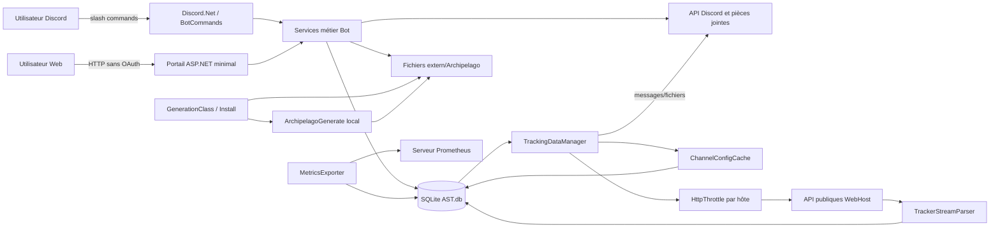

# Audit Phase 0 — ArchipelagoSphereTracker

Date de l'audit : 29 août 2026  
Révision inspectée : `e88a224` (`codex/evolution`)  
Périmètre : état de travail local, y compris les modifications non commitées déjà présentes dans le portail et ses traductions.

## 1. Conclusion exécutive

AST est une application .NET 8 monolithique mais lisible, organisée par responsabilités (`Bot`, `TrackerLib`, `SqlCommands`, `Web`, `Install`). Elle respecte déjà la contrainte centrale du brief : aucune connexion au protocole Archipelago n'a été trouvée. Les données de partie proviennent des API HTTP du WebHost.

Les deux modes demandés existent et doivent être conservés :

- **Normal** : suivi de rooms WebHost et notifications Discord ;
- **Archipelago** : fonctions du mode Normal, installation locale d'Archipelago, YAML, APWorld, génération, sauvegarde et restauration.

Le socle fonctionnel est réel : polling multi-room, parsing tolérant de plusieurs champs WebHost, limitation HTTP par hôte, déduplication partielle par SQLite, alias Discord, recaps, hints, métriques, portail personnel et génération locale. Une réécriture complète n'est donc ni nécessaire ni souhaitable.

Trois blocages doivent cependant précéder l'ambition « bot de référence » :

1. **Sécurité critique du portail** : des endpoints sans authentification permettent des mutations sensibles, jusqu'à l'upload d'un APWorld et au lancement d'une génération.
2. **Fiabilité de livraison** : l'état est enregistré avant l'envoi Discord, sans journal d'événements ni outbox ; un crash peut perdre définitivement une notification.
3. **Modèle de persistance incomplet** : plusieurs `INSERT OR REPLACE` ne disposent pas de contrainte unique correspondante, notamment pour les rooms et les hints.

La recommandation est une évolution incrémentale : sécuriser d'abord la surface existante, ajouter ensuite un modèle d'événements et des snapshots en parallèle des tables historiques, puis basculer progressivement vers un scheduler central durable.

## 2. Architecture actuelle



### Cartographie des composants

| Domaine | État actuel | Points d'entrée principaux |
|---|---|---|
| Démarrage | Sélection du mode par argument, migration SQLite, connexion Discord, démarrage du tracking, portail et métriques | `src/Program.cs`, `src/Declare.cs` |
| Commandes Discord | 30 commandes de premier niveau environ, dispatch manuel par `switch`, autocomplétion, réponses différées | `src/Bot/BotCommands.cs`, `src/Bot/SlashCommandDefinitions.cs` |
| Suivi WebHost | Une tâche globale, passage toutes les 60 s, parallélisme de 10 guildes et 1 canal par guilde, exclusion en mémoire des canaux déjà en vol | `src/TrackingDataManager.cs` |
| Résilience HTTP | Mutex et espacement de 1 s par hôte, 3 essais sur 429/5xx/erreur réseau, `Retry-After`, backoff court | `src/Bot/HttpThrottle.cs`, `src/HttpClientFactory.cs` |
| Parsing | Parsing streaming JSON des items, hints, checks et activité ; inconnus ignorés ; fallback `PlayerN` et IDs bruts | `src/TrackerLib/Services/TrackerStreamParser.cs`, `ProcessingContext.cs` |
| Stockage | SQLite WAL, verrou global d'écriture, transactions applicatives, 19 tables métier, migrations numérotées jusqu'à 5.0.5 | `src/SqlCommands/*` |
| Génération | Exécution locale de `ArchipelagoGenerate`, timeout 30 min, YAML par canal, ZIP de YAML, sorties ZIP | `src/Bot/GenerationClass.cs` |
| YAML/APWorld | Upload, liste, suppression, backup ; génération de templates après ajout d'un APWorld | `src/Bot/YamlClass.cs`, `ApworldClass.cs`, `src/Install/CustomApworldClass.cs` |
| Sauvegarde/restauration | Copie des ROMs, APWorld et joueurs autour des mises à jour d'Archipelago | `src/Install/BackupRestoreClass.cs`, `InstallClass.cs` |
| Portail Web | ASP.NET minimal sur `0.0.0.0`, pages HTML générées, API personnelle par token URL, pages de commandes globales et room | `src/Web/*` |
| Authentification | Token opaque permanent pour le portail personnel uniquement ; pas d'OAuth Discord, session, expiration, scope ou contrôle de rôle commun | `PortalAccessCommands.cs`, `WebPortalServer.cs` |
| Traduction | Ressources `.resx` anglaises et françaises, culture globale issue de `LANGUAGE` | `src/Resources/*` |
| Observabilité | Logs texte vers stdout et gauges Prometheus collectées toutes les 5 min | `src/MetricsExporter.cs` |
| GUI | Administration locale Avalonia : configuration `.env`, démarrage/arrêt et logs | `src/Gui/*` |
| Déploiement | Publication self-contained Windows/Linux par GitHub Actions, scripts `.bat`/`.sh` | `.github/workflows/*`, `Install/*`, `publish.bat` |

### Flux de suivi actuel

```mermaid
sequenceDiagram
    participant Loop as Boucle globale (60 s)
    participant Cache as Cache rooms
    participant WH as WebHost
    participant DB as SQLite
    participant Discord as Discord

    Loop->>Cache: rooms arrivées à échéance
    Loop->>WH: GET room_status
    Loop->>WH: GET tracker
    Note over Loop,WH: static_tracker seulement à l'ajout
    Loop->>Loop: parse items, hints, statuts
    Loop->>DB: écrit nouveaux états/items
    Loop->>Discord: publie les notifications
    Loop->>DB: met à jour LastCheck
```

La séquence `DB puis Discord` évite plutôt les doublons après redémarrage, mais transforme un crash entre les deux étapes en **perte définitive de notification**. Il n'existe pas de statut de livraison permettant une reprise.

## 3. API externes consommées

### Données de partie WebHost

| Endpoint | Usage | Appelant | Robustesse actuelle |
|---|---|---|---|
| `GET {origin}/api/room_status/{room}` | joueurs, jeux, tracker, port, téléchargements, dernière activité | `UrlClass.RoomInfo` | throttle commun, 429/5xx, désérialisation tolérante ; aucune validation de schéma/origine |
| `GET {origin}/api/tracker/{tracker}` | items reçus, hints, checks, activité | `TrackingDataManager.GetTableDataAsync` | timeout global 180 s, parsing streaming ; HTML/JSON invalide remonte comme erreur du canal |
| `GET {origin}/api/static_tracker/{tracker}` | totaux par slot et checksums de datapackages | ajout de room, migration | plusieurs chemins d'appel n'utilisent pas tous le throttle commun |
| `GET {origin}/api/datapackage/{checksum}` | noms/groupes items et locations | `DatapackageStore`, `DatapackageClient` | timeout 120 s ; limite de 64 Mio appliquée seulement aux fichiers locaux, pas aux réponses HTTP |

### Autres accès réseau

- API Discord et URLs temporaires des pièces jointes Discord ;
- releases GitHub Archipelago pour l'installation locale ;
- feuille Google publique d'information APWorld, transmise comme lien seulement.

### Contrainte « jamais de protocole Archipelago »

Aucune référence à `Archipelago.MultiClient`, `ArchipelagoSession` ou à un client socket Archipelago n'a été trouvée. Le processus local `ArchipelagoGenerate` est utilisé uniquement pour la génération. La contrainte est donc respectée dans l'état inspecté.

## 4. Données persistées

### SQLite

| Groupe | Tables |
|---|---|
| Rooms et patches | `ChannelsAndUrlsTable`, `UrlAndChannelPatchTable` |
| Joueurs et préférences existantes | `AliasChoicesTable`, `ReceiverAliasesTable`, `RecapListTable`, `RecapListItemsTable`, `ExcludedItemTable` |
| État observé | `DisplayedItemTable`, `HintStatusTable`, `GameStatusTable`, `LastItemsCheckTable` |
| Datapackages | `DatapackageItems`, `DatapackageItemGroups`, `DatapackageLocations`, `DatapackageLocationGroups`, `DatapackageGameMap` |
| Portail et outils | `PortalAccessTable`, `UpdateAlertsTable`, `SpoilerSphereValidationTable` |
| Version | `BddVersion` créée par le migrateur |

Les identifiants de room/tracker, liens de patch et tokens du portail sont stockés en clair. Il n'existe ni snapshot normalisé complet, ni journal d'événements, ni état de livraison, ni santé de room, ni audit de sécurité.

### Système de fichiers

| Chemin logique | Contenu / rétention |
|---|---|
| `.env` | token Discord et configuration ; ignoré par Git, non chiffré |
| `extern/Archipelago/Players/{channel}/yaml` | YAML persistants, pas de rétention automatique |
| `extern/Archipelago/Players/{channel}/zip` | extraction de ZIP de génération, nettoyée au prochain run ou à la suppression de room |
| `extern/Archipelago/Players/{channel}/spoiler` | dernier spoiler log, remplacé au prochain upload |
| `extern/Archipelago/custom_worlds` | APWorld persistants, partagés par l'instance |
| `extern/Archipelago/output/{channel}` | résultats de génération, remplacés au prochain run |
| `extern/portal` | pages statiques, tokens dans les chemins et téléchargements |
| `extern/portal/{guild}/downloads` | backups/résultats Web supprimés après 1 h par un worker toutes les 5 min |
| `archive`, `tempExtract`, `backup_*` | installation, archives et sauvegardes locales |

## 5. Tâches périodiques et concurrence

| Tâche | Fréquence | Reprise/arrêt | Risque principal |
|---|---:|---|---|
| Tracking global | tick 60 s, fréquence room 5 min à 1 jour | cancellation globale partielle ; reprise par `LastCheck` | pas de file de priorité, état d'erreur ou reprise de livraison |
| Recharge du cache | 1 h | cache reconstruit depuis SQLite | `Clear()` concurrent avec les commandes : une mise à jour peut disparaître du cache |
| Export métriques | 5 min | token local non conservé, serveur non disposé explicitement | arrêt incomplet, labels sensibles et forte cardinalité |
| Nettoyage téléchargements | 5 min, rétention 1 h | correctement annulé par `StopAsync` | fichiers publiquement accessibles pendant la rétention |
| Inactivité des threads | évaluée lors du polling | avertissement à 7 jours, suppression à 14 jours | room supprimée automatiquement, politique non configurable |

Points de concurrence :

- `StartTracking()` peut être déclenché par `Ready` et par `Connected + 10 s`. L'ancien worker est annulé sans être attendu, ce qui autorise une fenêtre de chevauchement.
- `InFlight` évite deux traitements simultanés d'un canal dans un seul processus, mais il n'existe ni lease persistante ni protection multi-instance.
- `Declare.AddedChannelId` (`List<string>`) et `Declare.WarnedThreads` (`HashSet<string>`) sont lus/modifiés par plusieurs tâches sans synchronisation.
- `Db.WriteGate` sérialise toutes les écritures du processus et protège bien les transactions locales, mais devient un goulot d'étranglement lors d'une grosse async.
- Le mutex HTTP par hôte limite de fait la concurrence à 1 par domaine et espace les départs, mais n'offre ni circuit breaker ni budget global.
- Le jitter est attaché au cache et ajouté au temps écoulé : il peut avancer une requête jusqu'à 60 s, au lieu de répartir les départs après l'échéance.

## 6. Fonctionnalités déjà présentes

Ces éléments du brief existent déjà au moins partiellement et ne doivent pas être recréés en doublon :

- modes Normal et Archipelago ;
- multi-guildes, multi-canaux et threads publics/privés ;
- ajout/suppression de room et blocage d'une même room dans deux threads d'une guilde ;
- fréquence manuelle avec minimum de 5 min et mode silencieux ;
- cache de configuration, limite de concurrence et throttle par hôte ;
- retries 429/5xx, `Retry-After`, timeouts et cancellation partiels ;
- parsing tolérant des champs inconnus, champs absents et alias manquants ;
- déduplication partielle des items, mise à jour des hints, détection de fin joueur ;
- regroupement des nouveaux items par receiver et découpe des messages Discord ;
- association Discord ↔ alias, plusieurs utilisateurs possibles par alias et filtres de catégories/items ;
- recaps, nettoyage, hints finder/receiver et analyse déterministe d'un spoiler log ;
- portail personnel par token, pages room/commandes, FR/EN ;
- YAML, APWorld, templates, backup/restauration et génération multiworld ;
- stockage des datapackages par checksum ;
- SQLite WAL, transactions d'écriture et suppression complète des données d'une guilde ;
- métriques Prometheus de progression/fraîcheur ;
- publication Windows/Linux et GUI d'administration.

## 7. Risques majeurs

### Critiques — bloqueurs avant exposition publique du portail

1. **Mutations Web non authentifiées.** Les routes `/commands/execute` et `/thread-commands/execute` n'appliquent aucune authentification. Un appelant connaissant ou devinant les IDs Discord peut ajouter/supprimer une room, changer le polling, lire des patches, manipuler YAML/APWorld et lancer une génération.
2. **Upload APWorld non autorisé.** Un APWorld contient du code de monde chargé par l'outil Archipelago local. L'absence de contrôle de rôle et de quarantaine crée un risque d'exécution de code dans le processus de génération.
3. **Accès aux fichiers privés.** Les listes/téléchargements YAML, les liens de patch et les résultats de génération sont exposés par des routes ou fichiers statiques sans contrôle utilisateur par fichier.
4. **SSRF par URL de room.** L'origine WebHost est fournie par l'utilisateur et n'est pas limitée à une allowlist HTTPS/publique ; le bot peut être amené à appeler une adresse interne.

### Élevés — fiabilité et intégrité

5. **Notifications perdues après crash.** Items/statuts sont persistés avant l'appel Discord, sans outbox ni retry de livraison.
6. **Rooms dupliquées en base.** `ChannelsAndUrlsTable` n'a pas de contrainte unique `(GuildId, ChannelId)` alors que l'écriture utilise `INSERT OR REPLACE`. Une édition insère donc potentiellement une nouvelle ligne.
7. **Hints dupliqués ou non mis à jour.** `HintStatusTable` n'a pas de contrainte unique ; de plus, la comparaison applicative ignore `Entrance` alors que l'`UPDATE` l'exige.
8. **Suppression trop large d'association.** La suppression d'un alias appelle une requête qui supprime tous les propriétaires du receiver, pas seulement l'utilisateur courant.
9. **Fin de room destructive.** Quand tous les checks atteignent le total, AST annonce puis supprime toutes les données de suivi. Le brief demande au contraire de conserver la room terminée avec une fréquence très basse et de permettre l'archivage.
10. **Uploads sans limites.** YAML, ZIP, APWorld et spoiler n'ont pas de plafond configuré, de validation de contenu, de quota extrait ou de protection explicite contre les ZIP bombs.
11. **Path traversal selon le chemin d'entrée.** Plusieurs commandes Discord et fonctions Web concatènent directement des noms ou IDs à des chemins ; l'autocomplétion et `Path.GetFileName` ne sont pas appliqués uniformément.
12. **Secrets et identifiants dans la télémétrie/logs.** URLs complètes, trackers et patches peuvent être écrits dans les logs. Les labels Prometheus incluent `BaseUrl`, `Room` et `Tracker`.

### Moyens

13. Les tokens de portail sont permanents, stockés en clair et placés dans l'URL ; aucune expiration, rotation, révocation ciblée ou utilisation unique.
14. Pas de CSRF, de rate limiting Web, d'OAuth Discord, de scopes ou de journal d'audit.
15. Le parsing tolère des absences simples, mais ne distingue pas réponse partielle, HTML, room endormie, tracker ancien ou incohérence temporaire.
16. Une réponse vide/partielle ne met pas à jour `LastCheck` et aucune santé persistée n'explique la cause.
17. Les modèles d'événements utilisent des noms localisés comme identité ; un changement d'alias fragilise les comparaisons. Les IDs slot/item/location doivent être conservés.
18. Les commandes longues sont lancées dans un `Task.Run` détaché ; la génération peut durer 30 min sans file globale ni verrou par événement.
19. `VACUUM` et `ANALYZE` sont exécutés à chaque initialisation de base, ce qui allonge et verrouille inutilement le démarrage.
20. Les erreurs de plusieurs couches sont avalées puis converties en valeurs vides, rendant le diagnostic et le retry non déterministes.

## 8. Dette technique

- Classe `TrackingDataManager` de près de 1 000 lignes mêlant orchestration, HTTP, diff, persistance, rendu Discord et rétention.
- Services statiques et état global (`Declare`) difficiles à isoler et tester.
- Dispatch Discord manuel et contrôle de permissions dispersé ; seule la suppression d'alias comporte un test administrateur explicite.
- Pas d'interface commune WebHost, horloge, file, publisher Discord ou stockage événementiel injectables.
- Schéma initial et migrations dupliquent de longs blocs SQL ; migration pilotée par une chaîne `BddVersion` et branches codées en dur.
- Plusieurs pseudo-upserts reposent sur des contraintes uniques absentes.
- Types numériques et dates stockés comme `TEXT` (`Checks`, `Total`, fréquence, activité).
- Valeurs de version incohérentes : application `0.6.7`, valeur MSBuild par défaut `0.0.0`, script local `5.5.12`, base `5.0.5`.
- 198 appels `Console.Write*`, sans niveau, structure, correlation ID ou redaction centrale.
- Le workflow CI publie les binaires mais n'exécute pas les tests ; permission `contents: write` accordée au job entier.
- Aucun Dockerfile, Compose, healthcheck applicatif, runbook de rollback, changelog ou politique de sauvegarde testée.
- Le `README` recommande `dotnet test` à la racine, mais sans solution ce chemin cible le projet principal et ne lance pas la suite xUnit ; le projet de tests doit être indiqué explicitement.
- Le projet principal référence directement `System.Runtime 4.3.1`, redondant sous .NET 8, et probablement `Newtonsoft.Json` sans usage direct trouvé.

## 9. Dépendances

Vérification effectuée contre les pages officielles NuGet le 29 août 2026. Une mise à jour automatique n'est pas recommandée dans l'audit ; chaque changement doit avoir sa PR et ses tests.

| Package | Version AST | État observé | Recommandation |
|---|---:|---|---|
| Avalonia / Desktop / Fluent | 11.3.7 | 12.1.1 courant ; 11.3.20 disponible sur la branche 11 | tester d'abord 11.3.20 ; traiter 12.x comme migration séparée |
| Discord.Net / Commands | 3.18.0 | 3.20.1 courant | PR dédiée avec tests d'enregistrement/interaction |
| DotNetEnv | 3.1.1 | 3.2.0 courant | mise à jour mineure dédiée |
| Microsoft.Extensions.DependencyInjection | 10.0.2 | 10.0.11 courant, alors que l'app cible .NET 8 | évaluer suppression via framework ASP.NET ou alignement LTS avant upgrade |
| Newtonsoft.Json | 13.0.4 | version courante ; aucun usage direct trouvé | supprimer si l'analyse de dépendances confirme l'inutilité |
| prometheus-net / AspNetCore | 8.2.1 | version courante | conserver, corriger surtout les labels et le cycle de vie |
| System.Data.SQLite.Core | 1.0.119 | version courante de cette famille | conserver durant les migrations ; évaluer la famille 2.x séparément |
| System.Runtime | 4.3.1 | ancien package de compatibilité, version officielle inchangée | retirer si build/tests multi-OS passent |

Sources : [Avalonia](https://www.nuget.org/packages/Avalonia), [Discord.Net](https://www.nuget.org/packages/Discord.Net), [DotNetEnv](https://www.nuget.org/packages/DotNetEnv), [Microsoft.Extensions.DependencyInjection](https://www.nuget.org/packages/Microsoft.Extensions.DependencyInjection), [System.Data.SQLite.Core](https://www.nuget.org/packages/System.Data.SQLite.Core), [prometheus-net](https://www.nuget.org/packages/prometheus-net).

## 10. Matrice fonctionnalités / tests

| Fonctionnalité | Tests actuels | Niveau | Tests manquants prioritaires |
|---|---|---|---|
| Parsing items/hints/checks | 4 tests parser + 2 convertisseurs | Partiel solide | champs `null`, ordre aléatoire, HTML, tronqué, gros payload, vieilles fixtures |
| Datapackages | 3 tests client/fetcher + contexte | Partiel | 404/429/5xx, limite HTTP, checksum incorrect, réponse partielle |
| DB rooms/config | 8 tests | Partiel, 1 échec | doublons, concurrence, contraintes, rollback, migration de versions réelles |
| Commandes slash | 2 tests de définition | Faible | permissions et exécution E2E |
| Alias/recap/filtres | couvert indirectement par DB | Faible | revendication concurrente, suppression multi-propriétaire, confidentialité |
| Spoiler analysis | 8 cas environ | Bon sur l'algorithme | permissions, upload, taille/rétention |
| Page portail utilisateur | 1 test HTML dans le worktree | Très faible | auth API, expiration, CSRF, isolation guild/channel/user |
| Scheduler/polling | aucun | Absent | priorité, limites, jitter, backoff, pause, cancellation, reprise |
| Normalisation/diff/snapshots | aucun composant dédié | Absent | ordre des collections, données partielles, invariants |
| Déduplication/livraison | test indirect items seulement | Absent | crash avant/après commit et Discord, rejeu, outbox |
| Permissions/audit | aucun | Absent | matrice complète Discord + portail |
| Uploads/ZIP/APWorld/YAML | aucun | Absent | traversal, bomb, taille, extension, contenu, quarantaine |
| Génération | aucun | Absent | verrou, timeout, cancellation, stderr, distribution par joueur |
| Portail serveur | aucun test HTTP | Absent | routes anonymes, scopes, rate limiting, fichiers statiques |
| Métriques/health/logs | aucun | Absent | redaction, cardinalité, endpoint live/ready |
| Installation/backup/restore | aucun | Absent | sauvegarde/restauration, échec partiel, rollback |
| Charge 1 000 rooms | aucun | Absent | scheduler, SQLite, reprise et rafale |

### Résultat d'exécution

Commande réellement nécessaire :

```powershell
dotnet test tests\ArchipelagoSphereTracker.Tests\ArchipelagoSphereTracker.Tests.csproj --configuration Release --no-restore
```

Résultat : **31 tests, 30 réussis, 1 échoué**.

Échec reproductible : `DatabaseCommandTests.CountChannelByGuildId_EnforcesLimit`. Le test ajoute 10 canaux puis attend `true`, alors que `Declare.MaxThreadByGuild` vaut 3. Il s'agit d'un test devenu incohérent avec la configuration, à corriger dans une PR triviale distincte.

État après réalisation de la PR 1 : **35 tests, 35 réussis** avec la commande racine
`dotnet test ArchipelagoSphereTracker.sln --configuration Release`, restauration NuGet comprise.
Les quatre nouveaux tests reposent uniquement sur des fixtures WebHost anonymisées.

Une seconde tentative de compilation dans le sandbox a aussi révélé que la télémétrie de build Avalonia tente d'écrire sous le profil utilisateur. Ce n'est pas un défaut runtime AST, mais la CI reproductible doit désactiver explicitement cette télémétrie et ne pas dépendre d'un profil mutable.

## 11. Écart entre le brief et l'existant

| Exigence | État | Écart principal |
|---|---|---|
| Scheduler central | Partiel | boucle globale existante, mais pas de priority queue, état durable, circuit breaker ou limites configurables |
| Polling adaptatif | Absent | fréquences fixes ; jitter incorrect ; room terminée supprimée |
| Snapshot normalisé | Absent | état réparti dans plusieurs tables, sans version/hash/atomicité globale |
| Événements idempotents | Absent | déduplication d'items seulement, pas de clé/ledger/outbox/rejeu |
| Tolérance API | Partiel | champs inconnus/absents et 429/5xx partiels ; aucune classification de santé |
| Santé et commandes `/ast-*health*` | Absent | seulement `LastCheck` et métriques générales |
| Rôles AST | Absent | identité utilisateur ponctuelle, presque aucun contrôle administrateur |
| Protection des données | Très insuffisant | secrets/URLs en clair, routes publiques, uploads non bornés |
| Journal d'audit | Absent | logs stdout non structurés |
| Assistant `/ast-setup` | Absent | `/add-url` et portail de commandes existants à réutiliser |
| Centre de contrôle persistant | Absent | messages multiples, aucune référence de message persistée |
| UI Discord native | Faible | slash/autocomplete ; pas de boutons, modales ou confirmations |
| Messages riches | Partiel | textes regroupés, sans templates structurés ni niveaux de détail |
| Anti-spam | Partiel | regroupement receiver/chunks et délai 1,1 s ; pas de fenêtre/digest/quota |
| Préférences utilisateur | Partiel | catégories exclues, items exclus, recap ; pas de canaux/horaires/digests |
| Association slots | Partiel | plusieurs associations possibles, sans validation organisateur ni historique |
| Organisation multiworld | Partiel | fichiers + génération, aucun événement/inscription/tableau de préparation |
| Validation YAML/APWorld | Très faible | extension seulement, pas de validation sémantique/version/hash/quarantaine |
| Distribution sécurisée | Absent | patchs et ZIP accessibles au niveau room/global |
| Dashboards | Partiel | page personnelle et commandes, pas de dashboard global/room complet |
| Mobile/accessibilité/PWA | Non démontré | HTML responsive partiel ; pas d'audit a11y/PWA |
| Analyse/récaps intelligents | Partiel | activité/checks/recaps/spoiler ; pas de jalons ou signaux prudents |
| Événement/race/stream/cartes/presets | Absent | aucun socle dédié |
| Plugins/API versionnée/webhooks | Absent | endpoints internes non versionnés et non authentifiés |
| Observabilité complète | Partiel | gauges, pas de logs structurés, compteurs/latences/files/health |
| DB production | Partiel | WAL/transactions/index, pas de migrations robustes/backups testés/rétention |
| Performance 1 000 rooms | Non démontré | aucune campagne de charge |
| Déploiement production | Partiel | releases binaires, pas de conteneurs/healthcheck/rollback documenté |

## 12. Matrice de rôles cible

Cette matrice doit être implémentée dans un service d'autorisation commun appelé côté serveur par Discord **et** le portail.

| Action | Propriétaire instance | Admin AST | Organisateur room | Joueur associé | Spectateur |
|---|:---:|:---:|:---:|:---:|:---:|
| Configuration globale, secrets, installation Archipelago | Oui | Non | Non | Non | Non |
| Créer/connecter une room | Oui | Oui | Oui si autorisé par la guilde | Non | Non |
| Modifier/pause/sync d'une room | Oui | Oui | Oui sur sa room | Non | Non |
| Supprimer/archiver/restaurer une room | Oui | Oui | Oui avec confirmation | Non | Non |
| Associer/remplacer un slot | Oui | Oui | Oui | revendication/confirmation propre | Non |
| Modifier ses notifications | Oui | Oui | Oui pour valeurs par défaut | Oui pour soi | Non |
| Upload/suppression YAML | Oui | Oui | Oui sur l'événement | Oui pour son slot avant verrouillage | Non |
| Upload/rollback APWorld | Oui | Oui selon politique | Oui si explicitement autorisé | Non | Non |
| Tester/générer/régénérer | Oui | Oui | Oui | Non | Non |
| Télécharger un patch | Oui | Oui | Oui | seulement ses fichiers | Non |
| Voir l'audit | Oui | Oui | événements autorisés de sa room | ses propres actions | Non |
| Voir progression non-spoiler | Oui | Oui | Oui | Oui | si room publique |

## 13. Plan de migration de base de données

Principes : migrations additives, transactionnelles, testées sur copies anonymisées, feature flags, aucune suppression de table historique dans les cinq premières PR.

### Étape A — sécuriser le mécanisme de migration

1. Sauvegarde obligatoire de `AST.db`, contrôle `PRAGMA integrity_check`, espace disque et version connue.
2. Ajouter `SchemaMigrations(MigrationId PRIMARY KEY, AppliedUtc, Checksum)` sans supprimer `BddVersion`.
3. Exécuter chaque migration une seule fois dans `BEGIN IMMEDIATE`, journaliser uniquement son identifiant et son résultat.
4. Supprimer `VACUUM` du chemin de démarrage normal ; le conserver comme maintenance explicite.

### Étape B — corriger les invariants existants

1. Détecter les doublons `(GuildId, ChannelId)` de `ChannelsAndUrlsTable`.
2. Choisir un enregistrement canonique de façon déterministe, rattacher/dédupliquer ses patches, puis créer `UNIQUE(GuildId, ChannelId)`.
3. Dédupliquer puis contraindre `ReceiverAliasesTable(GuildId, ChannelId, Receiver, UserId)`.
4. Définir une clé stable de hint et dédupliquer avant d'ajouter sa contrainte unique.
5. Tester upgrade, rollback logique et idempotence sur fixtures v4, 5.0.0 et 5.0.5.

### Étape C — tables V2 additives

- `TrackedRooms` : identité interne, guild/channel, origine WebHost, identifiants sensibles chiffrés, mode de polling, bornes, pause, état, prochaines échéances et erreurs.
- `RoomSnapshots` : `RoomId`, version de schéma, payload normalisé, hash, activité et dernière synchro réussie.
- `TrackingEvents` : `EventId`, `StableKey UNIQUE`, room, type, timestamps, payload, version de snapshot et état de suppression/rejeu.
- `EventDeliveries` : destination, statut, tentatives, prochaine tentative, date d'envoi et ID du message Discord, avec `UNIQUE(EventId, DestinationKey)`.
- Plus tard : `RoomMembers`, `RoleBindings`, `AuditLog`, `UploadAssets`, `GenerationRuns`.

### Étape D — backfill et coexistence

1. Backfill `TrackedRooms` depuis les lignes canoniques existantes.
2. Au premier poll V2, enregistrer un snapshot de référence **sans publier l'historique**.
3. Marquer les événements historiques éventuellement importés comme `SuppressedBaseline`.
4. Activer un dual-write contrôlé par feature flag et comparer les résultats V1/V2 sans double notification.
5. Basculer lecture et publication room par room ; rollback = désactivation du flag, tables historiques intactes.

### Étape E — retrait différé

Les tables V1 ne seront supprimées qu'après au moins une version stable, validation de restauration et métriques montrant zéro lecture V1. Cette étape est hors des cinq premières PR.

## 14. Plan précis des cinq premières PR

La découverte des routes Web anonymes impose une PR de confinement avant la séquence fonctionnelle conseillée. Le polling adaptatif devient donc PR 6.

### PR 1 — Audit reproductible et tests de caractérisation

**Problème** : comportement actuel non figé, commande de test ambiguë, test de limite obsolète, CI sans tests.

**Contenu** :

- intégrer ce rapport FR et son résumé EN ;
- ajouter une solution ou un script de validation qui cible explicitement le projet xUnit ;
- corriger uniquement le test de limite pour utiliser `Declare.MaxThreadByGuild` ;
- ajouter fixtures WebHost anonymisées et tests de caractérisation : ajout initial silencieux, ordre des collections, alias manquant, champs inconnus, redémarrage sans republication ;
- faire exécuter build + tests Windows/Linux avant le publish ;
- aucun changement de comportement métier.

**Critères d'acceptation** :

- suite verte sur Windows et Linux ;
- `dotnet test` documenté exécute réellement tous les tests ;
- fixture sans room/tracker/token réel ;
- état de départ et limites connus sont figés ;
- rollback : retrait des tests/docs/CI sans migration ni donnée modifiée.

### PR 2 — Confinement sécurité et autorisation centralisée minimale

**Problème** : opérations Web/Discord sensibles accessibles sans rôle commun.

**Contenu** :

- fermer par défaut les pages/routes de commandes anonymes ;
- créer `IAstAuthorizationService` et une première matrice owner/admin/organisateur/joueur/spectateur ;
- exiger une identité Discord vérifiée et un scope pour chaque mutation ;
- restreindre immédiatement APWorld, génération, suppression de room, backups et patches ;
- redacter URLs/tracker/patch/token dans logs et métriques ;
- bornes de taille conservatrices et noms de fichiers normalisés ;
- tests de permission et tests négatifs HTTP ;
- pas encore d'éditeur ou de nouveau portail.

**Critères d'acceptation** :

- chaque action sensible possède au moins un test `autorisé` et `refusé` ;
- aucune route mutante n'est anonyme ;
- un joueur ne peut lire que son patch/YAML autorisé ;
- SSRF vers loopback, réseau privé et schéma non HTTPS refusé, avec allowlist configurable pour WebHosts privés explicitement approuvés ;
- aucun secret complet dans logs/métriques de test ;
- rollback : portail de commandes désactivé, commandes Discord historiques toujours disponibles avec garde serveur.

### PR 3 — Modèle d'événements normalisé pur

**Problème** : parsing, diff, rendu et livraison sont couplés ; aucune identité stable commune.

**Contenu** :

- modèles immuables `NormalizedRoomSnapshot` et événements du brief ;
- conserver les IDs WebHost bruts (slot, item, location) avec fallback d'affichage séparé ;
- normalizer collections, `null`, alias manquant, ordre et champs inconnus ;
- fonction pure `Diff(previous, current)` ;
- génération documentée des clés stables, sans I/O ni Discord ;
- adapters temporaires depuis les modèles actuels ;
- fixtures et tests unitaires exhaustifs.

**Critères d'acceptation** :

- permuter l'ordre JSON ne change ni snapshot hash ni événements ;
- le même diff produit exactement les mêmes clés ;
- tous les types P0 sont couverts ;
- réponse partielle ne produit pas de faux événement destructif ;
- aucun changement de notification en production tant que le feature flag est désactivé ;
- rollback : supprimer le module V2, aucune migration.

### PR 4 — Snapshots, ledger idempotent et outbox persistante

**Problème** : pas de commit atomique snapshot/événements et notifications perdues après crash.

**Contenu** :

- migrateur versionné et tables `TrackedRooms`, `RoomSnapshots`, `TrackingEvents`, `EventDeliveries` ;
- nettoyage déterministe des doublons V1 et contraintes uniques indispensables ;
- transaction atomique snapshot + événements + outbox ;
- baseline initiale sans republication ;
- worker de livraison rejouable et déduplication par destination ;
- dual-write sous feature flag ;
- tests de migration et crash aux frontières de transaction/livraison.

**Critères d'acceptation** :

- un redémarrage ne republie pas l'historique ;
- crash avant commit = aucun état partiel ;
- crash après commit/avant Discord = livraison reprise ;
- crash après Discord simulé = pas de double publication au retry contrôlé ;
- migrations idempotentes sur bases anonymisées v4/v5 ;
- rollback par feature flag, tables V1 conservées.

### PR 5 — Scheduler central et client WebHost résilient

**Problème** : scan minute sans priorité ni santé durable, lifecycle concurrent et résilience HTTP dispersée.

**Contenu** :

- service hébergé unique avec priority queue par `NextPollAt` ;
- budgets globaux et par origine, timeouts par endpoint, jitter après échéance ;
- backoff exponentiel avec plafond, `Retry-After`, circuit breaker et classification 404/429/5xx/HTML/partiel ;
- promotion après commande utilisateur avec rate limit strict ;
- cancellation/arrêt gracieux et reprise depuis SQLite ;
- suppression des doubles démarrages `Ready`/`Connected` ;
- métriques file, retard, latence, erreurs et breaker, sans labels sensibles ;
- ancien scheduler disponible derrière rollback flag durant la transition.

**Critères d'acceptation** :

- une seule instance de scheduler par processus ;
- limites globale/par domaine jamais dépassées sous test ;
- une room en échec n'affecte pas les autres ;
- arrêt sans nouvelle requête et sans tâche orpheline ;
- reprise après redémarrage respecte `NextPollAt` et les événements en attente ;
- tests déterministes avec horloge et HTTP simulés ;
- test de charge minimal 1 000 rooms sans boucle par room.

## 15. Backlog après les cinq premières PR

1. PR 6 : polling adaptatif et commandes santé/pause/reprise/sync forcée.
2. PR 7 : audit de sécurité complet, chiffrement au repos, uploads/quarantaine/rétention.
3. PR 8 : assistant `/ast-setup` fondé sur la nouvelle autorisation.
4. PR 9 : centre de contrôle Discord persistant et templates de messages.
5. PR 10 : préférences personnelles, claims de slots et historique.
6. PR 11 : anti-spam, fenêtres de regroupement et digests.
7. PR 12+ : inscriptions, préparation, validation YAML/APWorld, portail progressif, overlays/API/plugins.

## 16. Correctifs triviaux à proposer séparément

- Corriger le test `CountChannelByGuildId_EnforcesLimit` pour dériver son seuil de `Declare.MaxThreadByGuild`.
- Corriger le README afin que la commande de test cible le projet xUnit ou une solution.
- Désactiver explicitement la télémétrie de build Avalonia dans la CI.
- Ne plus écrire `VACUUM` à chaque démarrage.
- Corriger le jitter pour retarder l'échéance au lieu de l'avancer.
- Remplacer les versions divergentes par une source de version unique.

Ces correctifs ne doivent pas être mélangés à la PR du scheduler ou au modèle d'événements.
