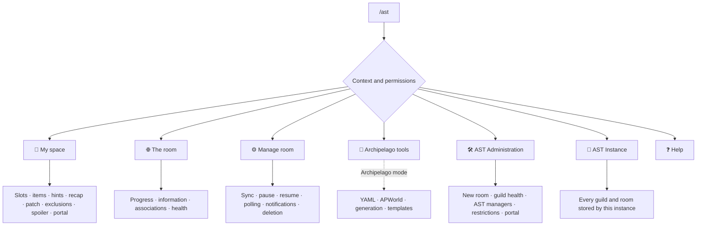
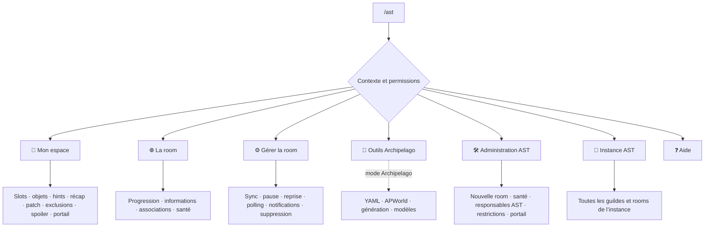

# `/ast` command center

[English](#english) · [Français](#français)

## English

AST provides `/ast` as its centralized interface while also registering the direct slash commands from `v5.6.7`:

```text
/ast
```

The interface is personal and ephemeral: other members cannot see your navigation or private results. A session expires after 15 minutes of inactivity and remains bound to the user, guild, and channel in which it was opened.

The direct commands are optional shortcuts to the same features. See [[Slash commands and AST|Legacy-command-migration]] for their names, required context, and permissions.



### Context-sensitive home screen

- **Inside a tracked thread**: direct access to My space, The room, Archipelago tools when enabled and allowed, and—depending on your permissions—Manage room or AST Administration.
- **Inside a regular server channel**: a paginated selector for accessible rooms, Archipelago tools when enabled and allowed, AST Administration, and help.
- **Inside an untracked thread**: no room is selected; return to a text channel to configure one.
- **In a direct message**: `/ast` is refused because the guild and permissions cannot be determined.

### My space

Available to every member who can view the room:

- **My slots**: mention filter, slot association, association/dissociation by name, and removal of the user's own associations.
- **My items**: items received by the user's slots.
- **My hints**: received or found hints.
- **My recap**: viewing and confirmed cleanup.
- **My patch**: download limited to an associated slot.
- **My exclusions**: add or remove items that should not notify this user.
- **Analyze spoiler**: analyze the room's shared spoiler log.
- **My portal**: issue or rotate a personal Web link.

A slot is not exclusive: several users may associate it. Only the exact duplicate “same user + same slot + same room” is rejected.

### The room

Displays tracking health, game progress, public information, and available associations. Large lists are paginated and can be filtered.

### Manage room

Restricted to the thread owner, members with **Manage Threads**, guild managers, and delegated AST managers:

- synchronize immediately;
- pause or resume tracking;
- choose automatic or fixed polling;
- switch between normal and silent notifications;
- issue or revoke the room portal;
- remove tracking and local data after confirmation.

### AST Administration

Restricted to administrators, the Discord guild owner, members with **Manage Server**, delegated AST managers, and the instance owner:

- configure a new room;
- inspect the health of every room in the guild;
- issue or revoke the administration portal;
- grant or revoke AST managers when the user has a real Discord management permission;
- restrict or restore a member's access to Archipelago tools when the user has a real Discord management permission.

### Archipelago tools

Visible in Archipelago mode to every member unless that member has been explicitly restricted:

- **YAML**: list, back up, delete, or clean player files;
- **APWorld**: list and back up installed APWorlds;
- **Generation**: test or run a generation and configure progression balancing;
- **Templates**: browse and download YAML templates independently from YAML management.

The instance owner cannot be restricted. A Discord guild owner, administrator, member with **Manage Server**, or the instance owner can manage the deny list under **AST Administration → Archipelago access restrictions**.

### AST Instance

Visible only to the user configured through `AST_OWNER_USER_ID`. This user can browse every stored guild and room, inspect health, force a synchronization, pause/resume, and clean orphaned entries.

### Importing a file

Discord cannot ask for an attachment from a button. Use the command option instead:

```text
/ast file:<file>
```

| Type | Mode | Where to run it | Minimum permission |
|---|---|---|---|
| `.txt`, `.json` | Normal and Archipelago | A tracked room thread | Room member |
| `.yaml` | Archipelago | Target generation channel | Member unless restricted |
| `.zip` | Archipelago | Target generation channel | Member unless restricted |
| `.apworld` | Archipelago | Target channel | Member unless restricted |

In Archipelago mode, `/ast` also provides the `skip-prog-balancing` option for ZIP generation.

See [[Slash commands and AST|Legacy-command-migration]] for the complete direct-command catalog.

---

## Français

AST propose `/ast` comme interface centralisée tout en enregistrant également les commandes slash directes de `v5.6.7` :

```text
/ast
```

L’interface est personnelle et éphémère : les autres membres ne voient ni votre navigation ni les résultats privés. Une session expire après 15 minutes d’inactivité et reste liée à l’utilisateur, au serveur et au salon où elle a été ouverte.

Les commandes directes sont des raccourcis facultatifs vers les mêmes fonctions. Voir [[Commandes slash et AST|Legacy-command-migration]] pour leurs noms, leur contexte et leurs droits.



### Accueil contextuel

- **Dans un thread suivi** : accès direct à Mon espace, La room, aux Outils Archipelago lorsqu’ils sont activés et autorisés et, selon vos droits, à Gérer la room ou Administration AST.
- **Dans un salon normal** : sélection paginée des rooms accessibles, Outils Archipelago lorsqu’ils sont activés et autorisés, Administration AST et aide.
- **Dans un thread non suivi** : aucune room n’est sélectionnée ; revenez dans un salon texte pour en configurer une.
- **En message privé** : `/ast` est refusé, car le serveur et les permissions ne peuvent pas être déterminés.

### Mon espace

Pour tout membre qui peut voir la room :

- **Mes slots** : filtre de mentions, association d’un slot, association/dissociation par nom et suppression de ses propres associations.
- **Mes objets** : objets reçus pour ses slots.
- **Mes hints** : hints reçus ou trouvés.
- **Mon récap** : consultation et nettoyage confirmé.
- **Mon patch** : téléchargement limité à un slot associé.
- **Mes exclusions** : ajout ou retrait d’objets à ne pas notifier pour soi.
- **Analyser le spoiler** : analyse du spoiler partagé de la room.
- **Mon portail** : création ou rotation d’un lien Web personnel.

Un slot n’est pas exclusif : plusieurs utilisateurs peuvent l’associer. Seul le doublon exact « même utilisateur + même slot + même room » est refusé.

### La room

Affiche la santé du suivi, la progression des jeux, les informations publiques et les associations disponibles. Les listes importantes sont paginées et peuvent être filtrées.

### Gérer la room

Réservé au propriétaire du thread, aux membres ayant **Gérer les fils**, aux gestionnaires du serveur et aux responsables AST délégués :

- synchroniser immédiatement ;
- suspendre ou reprendre le suivi ;
- choisir le polling automatique ou fixe ;
- basculer les notifications normales/silencieuses ;
- créer/révoquer le portail de room ;
- supprimer le suivi et les données locales après confirmation.

### Administration AST

Réservé aux administrateurs, au propriétaire du serveur, aux membres ayant **Gérer le serveur**, aux responsables AST délégués et au propriétaire d’instance :

- configurer une nouvelle room ;
- consulter la santé de toutes les rooms du serveur ;
- créer/révoquer le portail d’administration ;
- accorder ou révoquer des responsables AST, si l’utilisateur possède un vrai droit Discord de gestion ;
- interdire ou rétablir l’accès d’un membre aux outils Archipelago, si l’utilisateur possède un vrai droit Discord de gestion.

### Outils Archipelago

Visible en mode Archipelago pour tous les membres, sauf ceux qui ont été explicitement interdits :

- **YAML** : lister, sauvegarder, supprimer ou nettoyer les fichiers joueurs ;
- **APWorld** : lister et sauvegarder les APWorlds installés ;
- **Génération** : tester ou lancer une génération et régler le progression balancing ;
- **Modèles** : parcourir et télécharger les modèles YAML indépendamment de la gestion YAML.

L’Owner de l’instance ne peut pas être interdit. Le propriétaire Discord, un administrateur, un membre ayant **Gérer le serveur** ou l’Owner de l’instance peut gérer la liste depuis **Administration AST → Restrictions d’accès Archipelago**.

### Instance AST

Visible uniquement par l’utilisateur défini dans `AST_OWNER_USER_ID`. Il peut parcourir toutes les guildes et rooms stockées, inspecter leur santé, forcer une synchronisation, suspendre/reprendre et nettoyer des entrées orphelines.

### Importer un fichier

Discord ne permet pas à un bouton de demander une pièce jointe. Utilisez donc l’option de la commande :

```text
/ast file:<fichier>
```

| Type | Mode | Où lancer la commande | Droit minimal |
|---|---|---|---|
| `.txt`, `.json` | Normal et Archipelago | Thread d’une room suivie | Membre de la room |
| `.yaml` | Archipelago | Salon cible de génération | Membre, sauf interdiction |
| `.zip` | Archipelago | Salon cible de génération | Membre, sauf interdiction |
| `.apworld` | Archipelago | Salon cible | Membre, sauf interdiction |

En mode Archipelago, `/ast` ajoute aussi l’option `skip-prog-balancing` pour les générations ZIP.

Voir [[Commandes slash et AST|Legacy-command-migration]] pour le catalogue complet des commandes directes.
