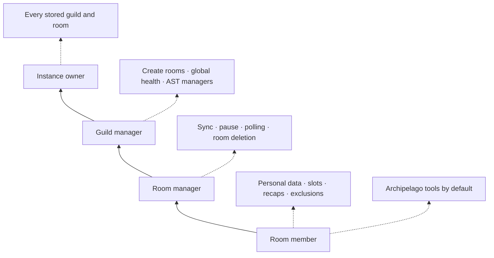
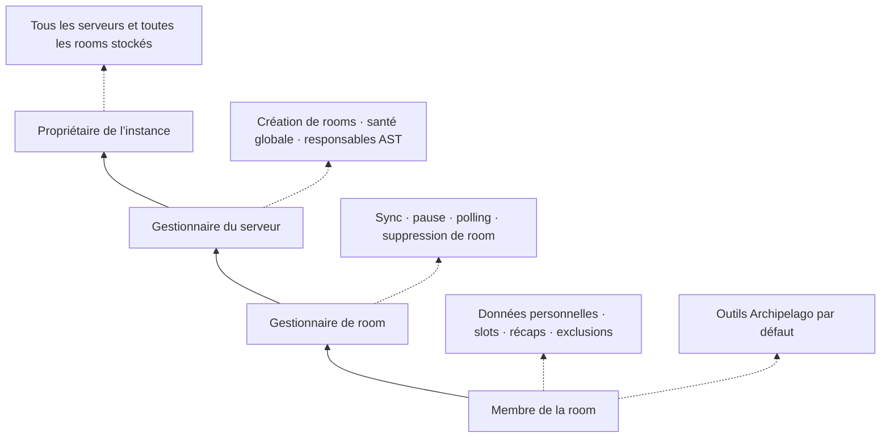

# Administration and security

[English](#english) · [Français](#français)

## English

Permissions are recomputed server-side for every action. Buttons displayed in Discord or the browser are never treated as proof of authorization.

### Access levels



| Level | Who receives it | Scope |
|---|---|---|
| **Member** | Discord member who can view the channel/thread | Read access and personal features |
| **Room manager** | Thread owner, member with **Manage Threads**, or a higher guild-level role | Configuration and control of that room |
| **Guild manager** | Discord owner, administrator, member with **Manage Server**, delegated AST manager, or instance owner | Every room in that guild |
| **Instance owner** | Exact user ID configured in `AST_OWNER_USER_ID` | Inspection, control, and cleanup of every guild/room in `AST.db` |

### Slash-command visibility

`/ast` and the restored `v5.6.7` commands are registered for the guild without a Discord default-member-permission filter. Members with **Use Application Commands** can therefore see them in Discord. Visibility does not grant access: AST resolves the member, channel/thread, delegated role, and instance-owner status before executing a direct command.

`/ast` additionally hides inaccessible sections in its private interface. See [[Slash commands and AST|Legacy-command-migration]] for the command-by-command matrix and the few current differences between direct commands and `/ast`.

### Archipelago deny list

In `--ArchipelagoMode`, YAML, APWorld, Generation, and Templates are available to every guild member by default. Access can be explicitly denied per member and per guild from:

```text
/ast → AST Administration → Archipelago access restrictions
```

Only the Discord guild owner, a Discord administrator, a member with **Manage Server**, or the instance owner can change this list. A delegated AST manager cannot change it. The restriction is persisted in SQLite, audited, and enforced for `/ast`, restored direct slash commands, and Archipelago Web-portal actions. The instance owner cannot be restricted.

### Delegated AST managers

A Discord owner, administrator, member with **Manage Server**, or the instance owner can open:

```text
/ast → AST Administration → AST Managers
```

They can grant a member AST management rights for the guild without assigning a Discord administrator role. The assignment is stored by Guild ID in SQLite and audited.

A delegated AST manager can manage rooms but cannot delegate that power in turn. Actual Discord administrators always keep their full rights.

### Instance owner

Set `AST_OWNER_USER_ID` to your own Discord user ID to obtain an emergency administration level across every guild and room stored by the instance. This is intended for the operator of a public bot who may need to diagnose a room, revoke a portal, or clean up stale instance data.

This value does not make another user a Discord administrator and does not grant Discord permissions to the bot itself. Keep the value limited to one trusted account.

### Secrets and stored data

- The Discord token in `.env` is the most sensitive secret and must never be published.
- A private portal URL is a bearer secret and must be protected like a password.
- SQLite stores only the SHA-256 hash of each portal token.
- Room, tracker, and patch values are intentionally stored in plaintext; see [[Data and migrations|Data-and-migrations]].
- Security audit entries omit complete private URLs and sensitive command arguments.

### Network and SSRF protection

AST accepts only valid HTTP(S) Archipelago room URLs. URLs containing embedded credentials, query strings, or fragments are rejected. Local, loopback, link-local, and private destinations are blocked by default, including after DNS resolution and redirects.

For a deliberately private WebHost, list only the required host names in `ARCHIPELAGO_ALLOWED_HOSTS`. Do not use this option as a broad wildcard.

### Destructive operations

Deleting a room or bulk-cleaning files requires an explicit confirmation. AST checks the permission again when the confirmation is submitted, records the action in the audit log, revokes related portal links, and removes the room-specific local data.

---

## Français

Les permissions sont recalculées côté serveur pour chaque action. Un bouton affiché dans Discord ou dans le navigateur n’est jamais considéré comme une preuve d’autorisation.

### Niveaux d’accès



| Niveau | Qui l’obtient | Portée |
|---|---|---|
| **Membre** | Membre Discord pouvant voir le salon/thread | Lecture et fonctions personnelles |
| **Gestionnaire de room** | Propriétaire du thread, membre avec **Gérer les fils**, ou rôle supérieur au niveau serveur | Configuration et contrôle de cette room |
| **Gestionnaire du serveur** | Propriétaire Discord, administrateur, membre avec **Gérer le serveur**, responsable AST délégué ou propriétaire de l’instance | Toutes les rooms de ce serveur |
| **Propriétaire de l’instance** | ID utilisateur exact configuré dans `AST_OWNER_USER_ID` | Inspection, contrôle et nettoyage de tous les serveurs/rooms de `AST.db` |

### Visibilité des slash commands

`/ast` et les commandes restaurées de `v5.6.7` sont enregistrés pour le serveur sans filtre Discord de permission par défaut. Les membres ayant **Utiliser les commandes de l’application** peuvent donc les voir dans Discord. La visibilité n’accorde aucun droit : AST vérifie le membre, le salon/thread, le rôle délégué et le statut d’Owner de l’instance avant d’exécuter une commande directe.

`/ast` masque en plus les sections inaccessibles dans son interface privée. Voir [[Commandes slash et AST|Legacy-command-migration]] pour la matrice commande par commande et les quelques différences actuelles entre commandes directes et `/ast`.

### Liste d’interdiction Archipelago

En `--ArchipelagoMode`, YAML, APWorld, Génération et Modèles sont disponibles par défaut pour tous les membres du serveur. L’accès peut être explicitement interdit par membre et par serveur depuis :

```text
/ast → Administration AST → Restrictions d’accès Archipelago
```

Seuls le propriétaire Discord, un administrateur Discord, un membre ayant **Gérer le serveur** ou l’Owner de l’instance peuvent modifier cette liste. Un responsable AST délégué ne le peut pas. L’interdiction est persistée dans SQLite, auditée et appliquée à `/ast`, aux slash commands directes restaurées et aux actions Archipelago du portail Web. L’Owner de l’instance ne peut pas être interdit.

### Responsables AST délégués

Un propriétaire Discord, un administrateur, un membre avec **Gérer le serveur** ou le propriétaire de l’instance peut ouvrir :

```text
/ast → Administration AST → Responsables AST
```

Il peut donner à un membre les droits de gestion AST pour le serveur sans lui attribuer un rôle d’administrateur Discord. L’attribution est stockée par Guild ID dans SQLite et journalisée.

Un responsable AST délégué peut gérer les rooms, mais ne peut pas déléguer ce pouvoir à son tour. Les véritables administrateurs Discord conservent toujours tous leurs droits.

### Propriétaire de l’instance

Définissez `AST_OWNER_USER_ID` avec votre propre ID utilisateur Discord pour obtenir un niveau d’administration d’urgence sur tous les serveurs et toutes les rooms stockés par l’instance. Cette fonction est destinée à l’opérateur d’un bot public qui peut avoir besoin de diagnostiquer une room, révoquer un portail ou nettoyer des données obsolètes.

Cette valeur ne transforme pas un autre utilisateur en administrateur Discord et n’accorde pas de permissions Discord supplémentaires au bot. Limitez-la à un seul compte de confiance.

### Secrets et données stockées

- Le token Discord contenu dans `.env` est le secret le plus sensible et ne doit jamais être publié.
- Une URL de portail privé est un secret porteur et doit être protégée comme un mot de passe.
- SQLite ne stocke que le hash SHA-256 de chaque token de portail.
- Les valeurs de room, tracker et patch sont volontairement stockées en clair ; voir [[Données et migrations|Data-and-migrations]].
- Le journal d’audit de sécurité omet les URLs privées complètes et les arguments sensibles des commandes.

### Réseau et protection SSRF

AST accepte uniquement des URLs de room Archipelago HTTP(S) valides. Les URLs contenant des identifiants intégrés, une query string ou un fragment sont refusées. Les destinations locales, loopback, link-local et privées sont bloquées par défaut, y compris après résolution DNS et redirection.

Pour un WebHost volontairement privé, indiquez uniquement les noms d’hôtes nécessaires dans `ARCHIPELAGO_ALLOWED_HOSTS`. N’utilisez pas cette option comme un wildcard général.

### Opérations destructives

La suppression d’une room ou le nettoyage global de fichiers demande une confirmation explicite. AST revérifie la permission au moment de confirmer, inscrit l’action dans le journal d’audit, révoque les portails associés et retire les données locales propres à la room.
