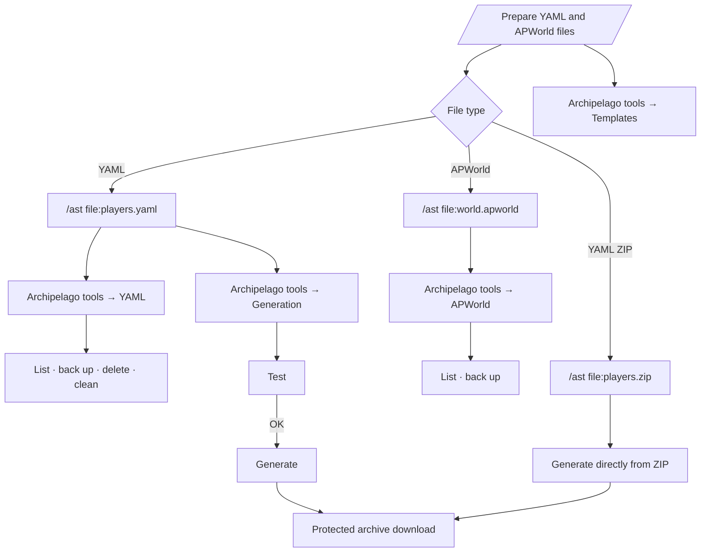
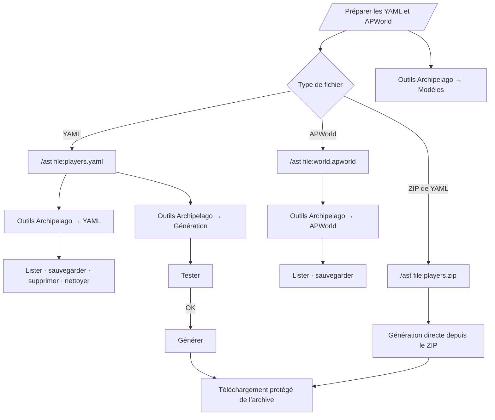

# Archipelago mode

[English](#english) · [Français](#français)

## English

Archipelago mode adds the installation and use of a local Archipelago environment to AST. It is intended for a private instance, normally connected to a single Discord guild.

Start it with:

```powershell
.\ArchipelagoSphereTracker.exe --ArchipelagoMode
```

```bash
./ArchipelagoSphereTracker --ArchipelagoMode
```

AST can separately install or update the local environment with `--install`. The runtime targets Windows x64 or Linux x64.

### Additional features

- import, list, back up, download, and delete YAML files;
- download available YAML templates;
- import, list, and back up APWorld files;
- test a generation before running it;
- generate from existing YAML files or from a ZIP archive;
- choose whether to skip progression balancing during generation;
- download generated archives through a private link.

### Recommended workflow



### Importing files

Discord buttons cannot request an attachment. Files can be uploaded through `/ast` with its optional file argument:

```text
/ast file:<players.yaml>
/ast file:<players.zip>
/ast file:<world.apworld>
```

YAML, APWorld, Generation, and Templates each have their own section under **Archipelago tools** on the `/ast` home screen. A YAML ZIP starts its generation workflow directly after validation.

The restored direct alternatives are `/send-yaml`, `/generate-with-zip`, and `/send-apworld`. The other direct administration commands are listed under [[Slash commands and AST|Legacy-command-migration]].

### File validation and quarantine

Uploads are first written to `extern/upload-quarantine/` and are not installed before validation succeeds. AST checks the extension, file signature and structure, normalizes archive paths, and rejects traversal or symbolic-link entries.

A ZIP archive may contain at most 500 entries and 256 MiB of uncompressed data. The normal `WEB_MAX_UPLOAD_BYTES` and Discord attachment limits still apply before these archive checks.

Protected downloads are placed under `extern/portal-downloads/` and require a valid private token.

### APWorld trust warning

An APWorld can contain executable Python code that will later be loaded by Archipelago. Install APWorld files only from authors and sources you trust. File validation can reject malformed or dangerous archive paths, but it cannot prove that the contained game code is safe.

Custom worlds are global assets of the Archipelago installation. Deleting a tracked room does not delete an installed APWorld.

### Permissions

Every guild member may use YAML, APWorld, Generation, and Templates by default. A Discord guild owner, administrator, member with **Manage Server**, or the instance owner can explicitly restrict a member under **AST Administration → Archipelago access restrictions**. The restriction applies to `/ast`, direct slash commands, and Archipelago Web-portal operations. The instance owner always retains access. See [[Administration and security|Administration-and-security]].

---

## Français

Le mode Archipelago ajoute à AST l’installation et l’utilisation d’un environnement Archipelago local. Il est destiné à une instance privée, normalement reliée à un seul serveur Discord.

Démarrez-le avec :

```powershell
.\ArchipelagoSphereTracker.exe --ArchipelagoMode
```

```bash
./ArchipelagoSphereTracker --ArchipelagoMode
```

AST peut installer ou mettre à jour séparément l’environnement local avec `--install`. Le runtime cible Windows x64 ou Linux x64.

### Fonctions supplémentaires

- importer, lister, sauvegarder, télécharger et supprimer les fichiers YAML ;
- télécharger les modèles YAML disponibles ;
- importer, lister et sauvegarder les fichiers APWorld ;
- tester une génération avant de la lancer ;
- générer depuis les YAML existants ou une archive ZIP ;
- choisir d’ignorer ou non le progression balancing pendant la génération ;
- télécharger les archives générées avec un lien privé.

### Workflow conseillé



### Importer les fichiers

Les boutons Discord ne peuvent pas demander de pièce jointe. Les fichiers peuvent être envoyés avec `/ast` et son argument facultatif :

```text
/ast file:<players.yaml>
/ast file:<players.zip>
/ast file:<world.apworld>
```

YAML, APWorld, Génération et Modèles possèdent désormais chacun leur propre rubrique sous **Outils Archipelago**, depuis l’accueil de `/ast`. Un ZIP de YAML lance directement son workflow de génération après validation.

Les alternatives directes restaurées sont `/send-yaml`, `/generate-with-zip` et `/send-apworld`. Les autres commandes directes d’administration sont listées dans [[Commandes slash et AST|Legacy-command-migration]].

### Validation et quarantaine des fichiers

Les uploads sont d’abord écrits dans `extern/upload-quarantine/` et ne sont pas installés avant la réussite de la validation. AST vérifie l’extension, la signature et la structure du fichier, normalise les chemins d’archive et refuse les entrées de traversée ou les liens symboliques.

Une archive ZIP peut contenir au maximum 500 entrées et 256 Mio de données décompressées. Les limites habituelles `WEB_MAX_UPLOAD_BYTES` et de pièce jointe Discord s’appliquent toujours avant ces contrôles d’archive.

Les téléchargements protégés sont placés sous `extern/portal-downloads/` et exigent un token privé valide.

### Avertissement de confiance APWorld

Un APWorld peut contenir du code Python exécutable qui sera ensuite chargé par Archipelago. Installez uniquement des APWorld provenant d’auteurs et de sources de confiance. La validation peut refuser un fichier mal formé ou des chemins d’archive dangereux, mais elle ne peut pas prouver que le code du jeu contenu est sûr.

Les custom worlds sont des assets globaux de l’installation Archipelago. La suppression d’une room suivie ne supprime pas un APWorld installé.

### Permissions

Tous les membres du serveur peuvent utiliser YAML, APWorld, Génération et Modèles par défaut. Le propriétaire Discord, un administrateur, un membre ayant **Gérer le serveur** ou l’Owner de l’instance peut interdire explicitement un membre depuis **Administration AST → Restrictions d’accès Archipelago**. Cette interdiction s’applique à `/ast`, aux slash commands directes et aux opérations Archipelago du portail Web. L’Owner de l’instance conserve toujours son accès. Voir [[Administration et sécurité|Administration-and-security]].
