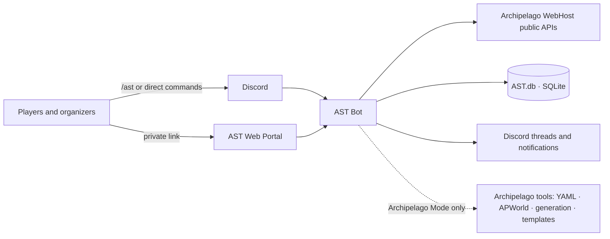
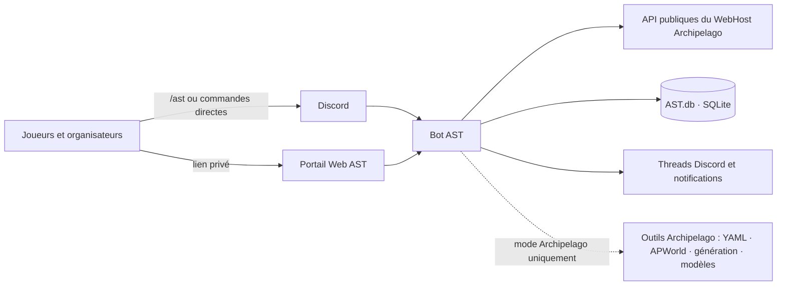

# ArchipelagoSphereTracker

[English](#english) · [Français](#français)

## English

ArchipelagoSphereTracker (AST) is a Discord bot that tracks Archipelago rooms, publishes newly received items, and centralizes player progress. Users can choose between the private `/ast` command center and the direct slash commands restored from `v5.6.7`.

### Quick start

1. To use the public bot, [invite AST](https://discord.com/oauth2/authorize?client_id=1408901673522430047) to your server.
2. Run `/ast` in a server channel.
3. An administrator or member with **Manage Server** opens **AST Administration → Configure room**.
4. Enter the exact `https://host.example/room/<id>` URL, choose the thread, notifications, and minimum polling frequency, then confirm.
5. In the created thread, each player opens **My space → My slots** and associates one or more slots.

Several people may associate the same slot, which is useful for multiplayer games. When an item arrives, AST mentions every relevant user while honoring individual mention filters and exclusions.

### Runtime modes

| Mode | Intended use | Features |
|---|---|---|
| **Normal** | Public bot or multi-server tracking instance | Rooms, items, hints, recaps, exclusions, portals, polling, and administration |
| **Archipelago** | Private instance, normally dedicated to one Discord server | Everything in Normal mode plus YAML, APWorld, generation, and backups |

Normal mode is enough to track a room hosted on an Archipelago WebHost. AST reads the public Web APIs and does not connect to the Archipelago game protocol.

In Archipelago mode, every member receives the **Archipelago tools** entry by default. Server administrators can explicitly restrict individual members when needed.

### Where to go next

- [[Installation]]: public bot, self-hosted instance, Windows, Linux, and the Discord Developer Portal.
- [[Configuration]]: every `.env` variable, reverse proxy setup, and upload limits.
- [[AST command center|AST-command-center]]: the complete `/ast` navigation tree.
- [[Slash commands and AST|Legacy-command-migration]]: direct-command catalog, contexts, and permissions.
- [[Room tracking|Room-tracking]]: room creation, adaptive polling, notifications, and the 7/14-day lifecycle.
- [[Web portal|Web-portal]]: private links, permissions, and revocation.
- [[Archipelago mode|Archipelago-mode]]: YAML/APWorld files and generation.
- [[Administration and security|Administration-and-security]]: AST roles, the instance owner, and the security model.
- [[Data and migrations|Data-and-migrations]]: SQLite, backups, and the former encryption migration.
- [[Troubleshooting|Troubleshooting]]: common errors, including `413 Request Entity Too Large`.

---

## Français

ArchipelagoSphereTracker (AST) est un bot Discord qui suit les rooms Archipelago, publie les nouveaux objets et centralise la progression des joueurs. Les utilisateurs peuvent employer le centre privé `/ast` ou les commandes slash directes restaurées depuis `v5.6.7`.

### Commencer rapidement

1. Pour utiliser le bot public, [invitez AST](https://discord.com/oauth2/authorize?client_id=1408901673522430047) sur votre serveur.
2. Dans un salon du serveur, lancez `/ast`.
3. Un administrateur ou un membre ayant **Gérer le serveur** ouvre **Administration AST → Configurer une room**.
4. Saisissez l’URL exacte `https://hote.example/room/<id>`, choisissez le thread, les notifications et la fréquence minimale, puis confirmez.
5. Dans le thread créé, chaque joueur utilise **Mon espace → Mes slots** pour associer son ou ses slots.

Plusieurs personnes peuvent associer le même slot, par exemple pour un jeu multi-joueur. Lorsqu’un objet arrive, AST mentionne toutes les personnes concernées selon leurs filtres et exclusions personnels.

### Deux modes d’exécution

| Mode | Usage | Fonctionnalités |
|---|---|---|
| **Normal** | Bot public ou instance de suivi multi-serveurs | Rooms, objets, hints, récaps, exclusions, portails, polling et administration |
| **Archipelago** | Instance privée, normalement dédiée à un seul Discord | Tout le mode Normal, plus YAML, APWorld, génération et sauvegardes |

Le mode Normal suffit pour suivre une room hébergée sur un WebHost Archipelago. AST lit les API Web publiques ; il ne se connecte pas au protocole de jeu Archipelago.

En mode Archipelago, tous les membres disposent par défaut de l’entrée **Outils Archipelago**. Les administrateurs du serveur peuvent interdire explicitement certains membres si nécessaire.

### Où aller ensuite ?

- [[Installation]] : bot public, instance personnelle, Windows, Linux et Discord Developer Portal.
- [[Configuration]] : toutes les variables `.env`, reverse proxy et limite d’upload.
- [[Centre de commandes AST|AST-command-center]] : arborescence complète de `/ast`.
- [[Commandes slash et AST|Legacy-command-migration]] : catalogue des commandes directes, contextes et droits.
- [[Suivi des rooms|Room-tracking]] : création, polling adaptatif, notifications et cycle de vie 7/14 jours.
- [[Portail Web|Web-portal]] : liens privés, permissions et révocation.
- [[Mode Archipelago|Archipelago-mode]] : fichiers YAML/APWorld et génération.
- [[Administration et sécurité|Administration-and-security]] : rôles AST, propriétaire d’instance et modèle de sécurité.
- [[Données et migrations|Data-and-migrations]] : SQLite, sauvegardes et ancienne migration de chiffrement.
- [[Dépannage|Troubleshooting]] : erreurs fréquentes, dont `413 Request Entity Too Large`.
