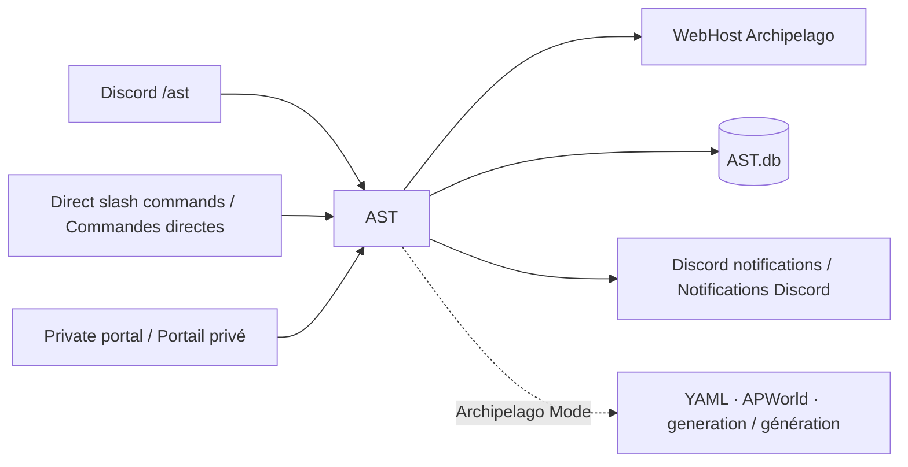
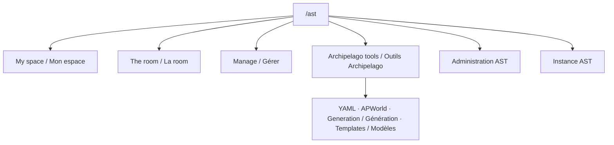

# Diagrams / Diagrammes

The Wiki documents both the `/ast` command center and the restored direct commands. Native Mermaid diagrams remain easier to keep current and edit directly in Markdown than command screenshots.

Le Wiki documente à la fois le centre `/ast` et les commandes directes restaurées. Les diagrammes Mermaid natifs restent plus simples à maintenir à jour et à modifier que des captures de commandes.

## Overview / Vue d’ensemble

## Navigation `/ast`

## More diagrams / Autres diagrammes

- [[Room creation and adaptive polling / Création et polling adaptatif|Room-tracking]]
- [[Portals and token rotation / Portails et rotation des tokens|Web-portal]]
- [[YAML/APWorld/generation workflow|Archipelago-mode]]
- [[Authorization levels / Niveaux d’autorisation|Administration-and-security]]
- [[Storage and migration / Stockage et migration|Data-and-migrations]]
