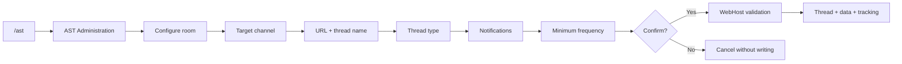
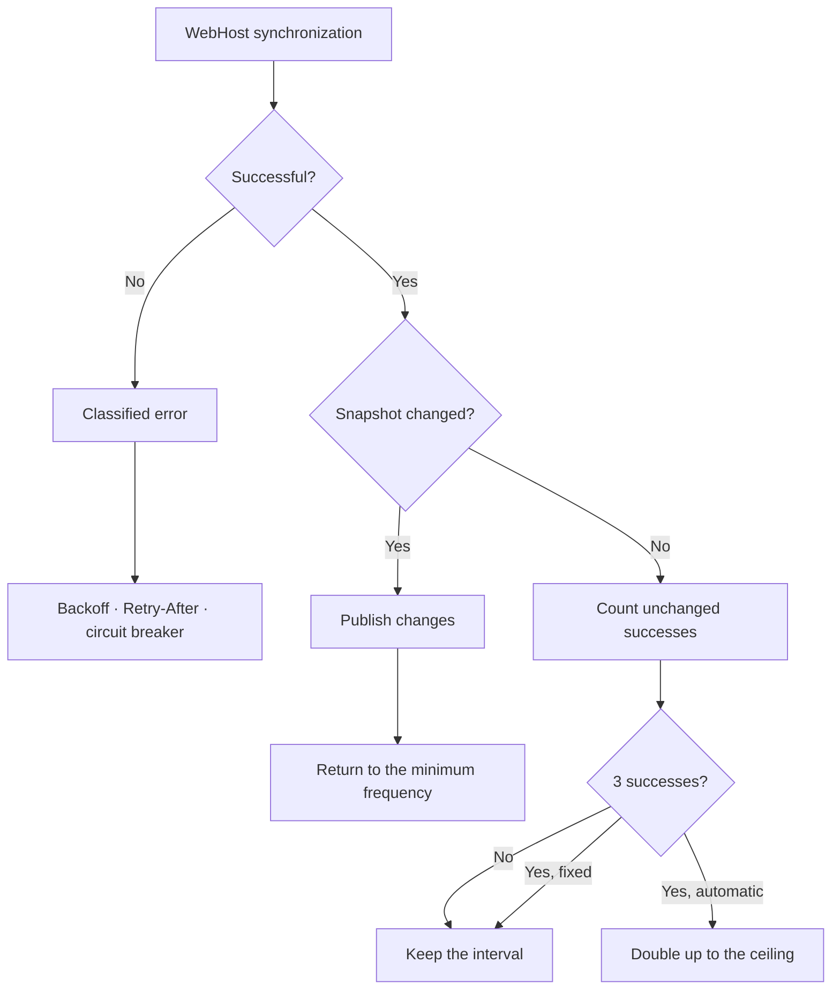
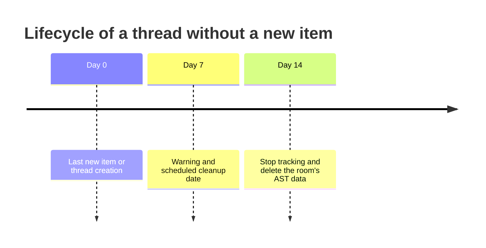
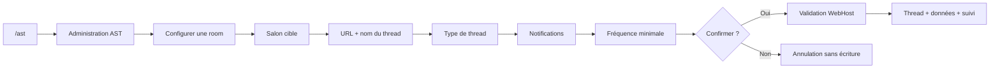
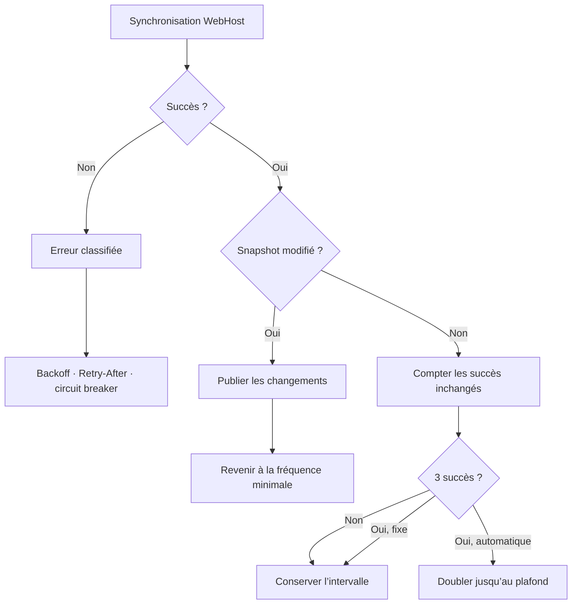
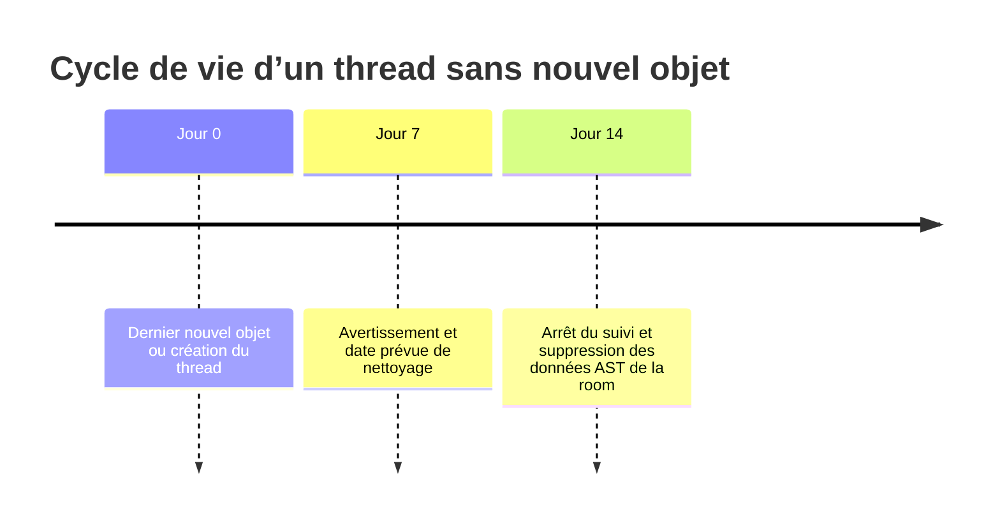

# Room tracking

[English](#english) · [Français](#français)

## English

### Configuring a room

From a text channel, open `/ast`, then **AST Administration → Configure room**. The wizard asks for:

1. the text channel that will host the thread;
2. the exact WebHost URL and thread name;
3. a private thread, public thread, or public thread with automatic member addition;
4. normal or silent notifications;
5. the minimum polling frequency;
6. final confirmation.

The URL must use the exact `http(s)://host/room/<id>` form, without HTTP credentials, a query string, or a fragment. The wizard summary displays only the validated host and never the full private identifier.

### Frequencies and adaptive polling

When creating a room, the available minimum frequencies are `5m`, `15m`, `30m`, `1h`, `6h`, `12h`, `18h`, and `1d`.

Automatic mode is used by default:

- the first successful poll uses the minimum frequency;
- after three successful unchanged synchronizations, the interval doubles;
- each new sequence of three unchanged successes can double it again;
- any detected change immediately returns it to the minimum;
- the initial ceiling is `1h`, unless the chosen minimum is longer, in which case that minimum becomes the ceiling.

From **Manage room → Polling**, managers can select:

- automatic mode with a `15m`, `30m`, `1h`, or `6h` ceiling, provided it is at least as long as the minimum;
- fixed mode at `5m`, `15m`, `30m`, `1h`, `6h`, `12h`, `18h`, or `1d`.

A small positive jitter can shift the exact time. The scheduler also limits concurrent requests globally and per WebHost origin.

### Tracking health and controls

The room view includes the running/paused state, configured and effective interval, last successful synchronization, last detected activity, next due time, consecutive failures, error type, and latency.

Managers can use:

- **Synchronize now**: immediate priority with a persistent 30-second cooldown;
- **Pause**: prevents future polls without cancelling one already in progress;
- **Resume**: re-enables and reschedules the room;
- **Polling**: changes the mode and interval;
- **Notifications**: switches between normal and silent behavior.

After each synchronization, the console reports the guild, thread, status, duration, and next run. Statuses distinguish no new item, new items, new hints, updated hints, completed goals, removed tracking, 404, rate limiting, server error, timeout, network error, HTML/invalid content, invalid JSON, partial response, and an open circuit.

### Shared slots and mentions

Several users can associate the same slot. For every new item, AST computes recipients separately from the slot association, item-type mention filter, and personal exclusions. Every remaining user is mentioned, while recap histories remain separate for each user.

**Silent** mode suppresses general announcements when no user is associated. Explicitly associated users continue receiving relevant notifications according to their preferences.

### Inactivity: 7 then 14 days

The timer is based on the last **newly received item**, or on the thread creation time if no item has ever been recorded.

At 14 days, AST removes the URL/configuration, items, hints, aliases, recaps, exclusions, polling state, portal tokens, and local room files. This routine does not delete the Discord thread itself. A new item before the deadline resets the timer.

### Legacy scheduler

`USE_LEGACY_TRACKING_SCHEDULER=true` temporarily restores the former scan loop. Pause/resume/forced synchronization controls and adaptive polling are unavailable in this mode. Use it only as a diagnostic rollback.

---

## Français

### Configurer une room

Depuis un salon texte, ouvrez `/ast` puis **Administration AST → Configurer une room**. L’assistant demande :

1. le salon texte qui hébergera le thread ;
2. l’URL WebHost exacte et le nom du thread ;
3. un thread privé, public, ou public avec ajout automatique des membres ;
4. des notifications normales ou silencieuses ;
5. la fréquence minimale de vérification ;
6. une confirmation finale.

L’URL doit avoir la forme exacte `http(s)://hôte/room/<id>`, sans identifiants HTTP, query string ni fragment. Le récapitulatif de l’assistant ne montre que l’hôte, jamais l’identifiant privé complet.

### Fréquences et polling adaptatif

À la création, les choix de fréquence minimale sont : `5m`, `15m`, `30m`, `1h`, `6h`, `12h`, `18h`, `1d`.

Par défaut, le mode est automatique :

- le premier succès utilise la fréquence minimale ;
- après trois synchronisations réussies sans changement, l’intervalle double ;
- chaque nouvelle série de trois succès inchangés peut le doubler à nouveau ;
- un changement le ramène immédiatement au minimum ;
- le plafond initial est `1h`, sauf si le minimum choisi est supérieur : le plafond devient alors ce minimum.

Dans **Gérer la room → Polling**, les gestionnaires peuvent sélectionner :

- automatique avec plafond `15m`, `30m`, `1h` ou `6h`, à condition qu’il soit au moins égal au minimum ;
- fixe à `5m`, `15m`, `30m`, `1h`, `6h`, `12h`, `18h` ou `1d`.

Un léger jitter positif peut décaler l’heure exacte. Le scheduler limite aussi les requêtes simultanées globalement et par origine WebHost.

### Santé et commandes de suivi

La vue de room affiche notamment : état en cours/pause, intervalle configuré et effectif, dernière synchronisation réussie, dernière activité, prochaine échéance, erreurs consécutives, type d’erreur et latence.

Les gestionnaires disposent de :

- **Synchroniser maintenant** : priorité immédiate avec cooldown persistant de 30 secondes ;
- **Pause** : arrête les prochains polls sans annuler celui déjà en cours ;
- **Reprendre** : réactive et reprogramme la room ;
- **Polling** : change le mode et l’intervalle ;
- **Notifications** : normal ou silencieux.

Après chaque synchronisation, la console indique le serveur, le thread, le statut, la durée et le prochain passage. Le statut distingue : aucun nouvel objet, nouveaux objets, nouveaux hints, hints mis à jour, objectifs terminés, suivi supprimé, 404, rate limit, erreur serveur, timeout, réseau, contenu HTML/invalide, JSON invalide, réponse partielle ou circuit ouvert.

### Slots partagés et mentions

Plusieurs utilisateurs peuvent associer le même slot. Pour chaque nouvel objet, AST calcule les destinataires individuellement : association au slot, filtre de type d’objet et exclusions personnelles. Tous les utilisateurs restants sont mentionnés ; les récaps restent séparés par utilisateur.

Le mode **silencieux** supprime les annonces générales sans association. Les utilisateurs explicitement associés continuent de recevoir les notifications qui les concernent selon leurs préférences.

### Inactivité : 7 puis 14 jours

Le délai est basé sur le dernier **nouvel objet reçu**, ou sur la date de création du thread si aucun objet n’a encore été enregistré.

À 14 jours, AST supprime l’URL/configuration, les objets, hints, alias, récaps, exclusions, état de polling, tokens de portail et fichiers locaux de la room. Le thread Discord lui-même n’est pas supprimé par cette routine. Un nouvel objet avant l’échéance réinitialise le délai.

### Scheduler historique

`USE_LEGACY_TRACKING_SCHEDULER=true` réactive temporairement l’ancien scan. Dans ce mode, les contrôles pause/reprise/synchronisation forcée et le polling adaptatif ne sont pas disponibles. Utilisez-le uniquement comme rollback de diagnostic.
