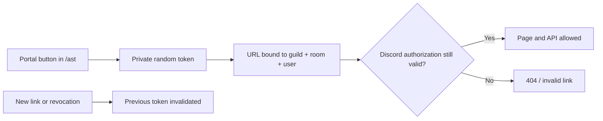
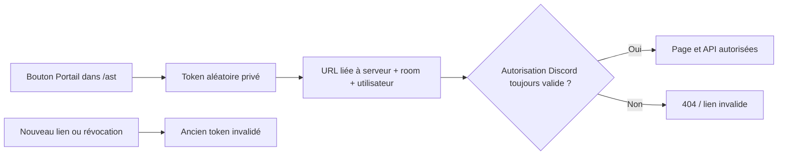

# Web portal

[English](#english) · [Français](#français)

## English

The Web portal is another interface to the same data and authorization rules as `/ast`. It is enabled when `ENABLE_WEB_PORTAL=true`.



### The three portals

| Portal | Access | Main features |
|---|---|---|
| **Personal** | Member with access to the room | Personal slots, items, hints, recaps, authorized patches, exclusions, shared spoiler |
| **Room** | `RoomManager` | Health, sync, pause/resume, polling, notifications, progress, patches, spoiler, and deletion |
| **Administration** | `GuildManager` | Guild rooms, global health, YAML/generation/APWorld depending on mode, audit, and links |

Archipelago operations in the administration portal also honor the guild's Archipelago deny list. A restricted administrator keeps the non-Archipelago administration features but cannot use YAML, APWorld, Generation, or Templates.

Issue links from the **My portal**, **Room portal**, or **AST Administration → Portal** buttons. Never build the URL manually.

### How private links work

- The token is a bearer secret: anyone who sees the URL can attempt to use it.
- SQLite stores only its SHA-256 hash.
- It is bound to the Discord guild, channel, and user.
- On every request, AST rechecks that the user still belongs to the guild, can still view the channel/thread, and has the required authorization level.
- Only one token is active for each `(guild, channel, user)` combination. Requesting a new link immediately invalidates the previous one for every portal in that combination.
- New links expire after `PORTAL_TOKEN_LIFETIME_DAYS` days, 30 by default.
- **Revoke portal** invalidates the token without creating another one.

Treat a portal URL like a password: do not publish it, include it in a GitHub issue, or leave it visible in screenshots.

### Exposing the portal through a reverse proxy

AST listens over HTTP on `0.0.0.0:WEB_PORT`. Expose it through HTTPS with Nginx, Caddy, or Traefik, then configure:

```dotenv
ENABLE_WEB_PORTAL=true
WEB_PORT=5199
WEB_BASE_URL=https://ast.example.com
```

Minimal Nginx example:

```nginx
server {
    listen 443 ssl;
    server_name ast.example.com;
    client_max_body_size 70m;

    location / {
        proxy_pass http://127.0.0.1:5199;
        proxy_http_version 1.1;
        proxy_set_header Host $host;
        proxy_set_header X-Real-IP $remote_addr;
        proxy_set_header X-Forwarded-For $proxy_add_x_forwarded_for;
        proxy_set_header X-Forwarded-Proto $scheme;
        proxy_read_timeout 86400;
        proxy_send_timeout 86400;
    }
}
```

Match `client_max_body_size` to `WEB_MAX_UPLOAD_BYTES` with a small margin. See [[Configuration]] for the 200 MiB example.

### Built-in security measures

Pages use `Cache-Control: no-store`, `Referrer-Policy: no-referrer`, a restrictive Content Security Policy, `X-Frame-Options: DENY`, and `X-Content-Type-Options: nosniff`. Downloads are served through authenticated routes, and former static download paths are blocked.

Sensitive actions are checked server-side and audited. Hiding a browser button does not grant or remove a permission.

### “Invalid portal link or insufficient permissions”

This usually means the token expired, was revoked or replaced, the user lost access to the Discord guild/thread, or the link was truncated. Run `/ast` in the correct context and request a new link. If the new link uses the wrong origin, correct `WEB_BASE_URL` on the instance running the bot and restart it.

---

## Français

Le portail Web est une autre interface vers les mêmes données et les mêmes règles d’autorisation que `/ast`. Il est actif lorsque `ENABLE_WEB_PORTAL=true`.



### Les trois portails

| Portail | Accès | Principales fonctions |
|---|---|---|
| **Personnel** | Membre ayant accès à la room | Slots personnels, objets, hints, récaps, patchs autorisés, exclusions, spoiler partagé |
| **Room** | `RoomManager` | Santé, sync, pause/reprise, polling, notifications, progression, patchs, spoiler et suppression |
| **Administration** | `GuildManager` | Rooms du serveur, santé globale, YAML/génération/APWorld selon le mode, audit et liens |

Les opérations Archipelago du portail d’administration respectent également la liste d’interdiction du serveur. Un administrateur interdit conserve les fonctions d’administration non liées à Archipelago, mais ne peut plus utiliser YAML, APWorld, Génération ou Modèles.

Créez les liens depuis les boutons **Mon portail**, **Portail de room** ou **Administration AST → Portail**. Ne construisez jamais l’URL à la main.

### Fonctionnement des liens privés

- Le token est un secret porteur : toute personne qui voit l’URL peut tenter de l’utiliser.
- SQLite ne stocke que son hash SHA-256.
- Il est lié au serveur, au salon et à l’utilisateur Discord.
- AST revérifie à chaque requête que l’utilisateur appartient toujours au serveur, voit toujours le salon/thread et possède le niveau demandé.
- Un seul token est actif par combinaison `(serveur, salon, utilisateur)` ; demander un nouveau lien invalide immédiatement l’ancien, pour tous les portails de cette combinaison.
- Les nouveaux liens expirent après `PORTAL_TOKEN_LIFETIME_DAYS` jours, 30 par défaut.
- **Révoquer le portail** invalide le token sans en créer un autre.

Traitez une URL de portail comme un mot de passe : ne la publiez pas, ne l’incluez pas dans un ticket GitHub et masquez-la dans les captures.

### Exposition derrière un reverse proxy

AST écoute en HTTP sur `0.0.0.0:WEB_PORT`. Exposez-le derrière HTTPS avec Nginx, Caddy ou Traefik, puis configurez :

```dotenv
ENABLE_WEB_PORTAL=true
WEB_PORT=5199
WEB_BASE_URL=https://ast.example.com
```

Exemple Nginx minimal :

```nginx
server {
    listen 443 ssl;
    server_name ast.example.com;
    client_max_body_size 70m;

    location / {
        proxy_pass http://127.0.0.1:5199;
        proxy_http_version 1.1;
        proxy_set_header Host $host;
        proxy_set_header X-Real-IP $remote_addr;
        proxy_set_header X-Forwarded-For $proxy_add_x_forwarded_for;
        proxy_set_header X-Forwarded-Proto $scheme;
        proxy_read_timeout 86400;
        proxy_send_timeout 86400;
    }
}
```

Adaptez `client_max_body_size` à `WEB_MAX_UPLOAD_BYTES`, avec une petite marge. Voir [[Configuration]] pour l’exemple 200 Mio.

### Mesures de sécurité intégrées

Les pages utilisent `Cache-Control: no-store`, `Referrer-Policy: no-referrer`, une Content Security Policy restrictive, `X-Frame-Options: DENY` et `X-Content-Type-Options: nosniff`. Les téléchargements sont servis par des routes authentifiées ; les anciens chemins statiques de téléchargement sont bloqués.

Les actions sensibles sont contrôlées côté serveur et auditées. Masquer un bouton dans le navigateur n’accorde ni ne retire une permission.

### « Invalid portal link or insufficient permissions »

Le message signifie généralement que le token a expiré, a été révoqué ou remplacé, que l’utilisateur a perdu l’accès Discord au serveur/thread, ou que le lien a été tronqué. Relancez `/ast` dans le bon contexte et demandez un nouveau lien. Si le nouveau lien contient une mauvaise origine, corrigez `WEB_BASE_URL` sur l’instance qui fait tourner le bot puis redémarrez-la.
